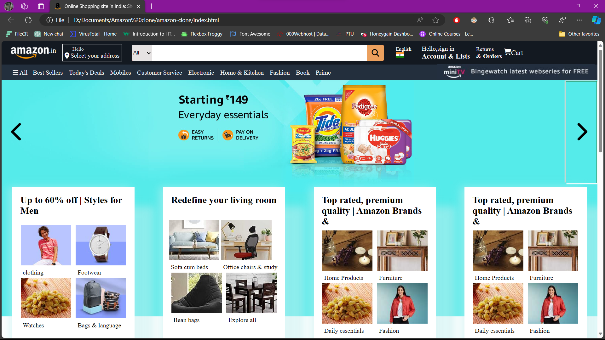

# Amazon_Clone_Shivam_Tripathi

**Amazon Clone by Shivam Tripathi**

*Overview*
This Amazon Clone project is a result of my dedication and learning in the web development course. As an aspiring developer, I aimed to recreate the essential features of the Amazon website to showcase my skills in full stack web development.

*Features*
User Authentication: Secure user authentication system allowing users to create accounts, log in, and log out.
Product Listings: Comprehensive display of products with images, descriptions, and pricing.
Shopping Cart: Users can add products to their cart, view the cart, and proceed to checkout.
Real-time Updates: Integration of real-time updates for product availability and pricing.
Payment Integration: Seamless payment processing using secure payment gateways.
Order History: Record of user's order history for future reference.
Responsive Design: Ensures a smooth and visually appealing experience across various devices.

*Technologies Used*
Frontend: HTML, CSS, React.js
Backend: Node.js, Express.js
Database: MongoDB
Authentication: Firebase Authentication
Payment Processing: Stripe API

*Installation*
Clone the repository: git clone [https://github.com/shivam0975/Amazon-clone]
Navigate to the project folder: cd amazon-clone
Install dependencies: npm install
Run the application: npm start

*How to Use*
Create an account or log in.
Explore products and add them to your cart.
Proceed to checkout and complete the payment.
View your order history.

Feel free to contribute to the project or report any issues. Happy shopping!
